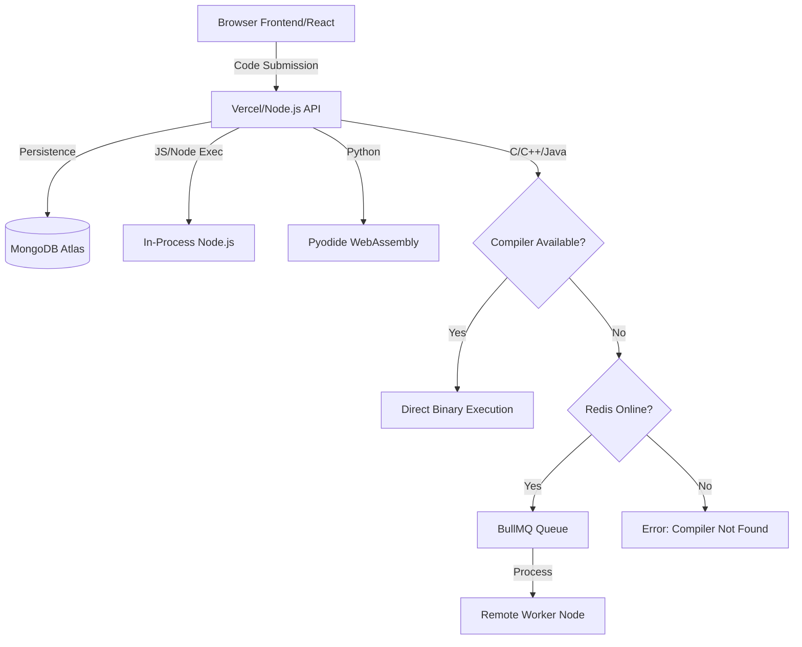

<div align="center">
  
  <br>
  <h1>LiquidIDE</h1>
  <p><b>The Next-Generation Cloud Code Editor</b></p>
  
  <p>
    
    
    
  </p>

  <p><i>A sleek, "Liquid Glass" themed browser IDE built for instant execution, zero-config deployments, and a premium developer experience.</i></p>
</div>

---

## ✨ Core Pillars

### 🚀 Performance
Experience sub-second execution. LiquidIDE uses a **Dual-Execution Engine** that intelligently leverages local compilers for performance and cloud fallbacks for portability.

### 🎨 Visual Excellence
Designed with a "Liquid Glass" aesthetic inspired by modern macOS interfaces. Featuring mesh gradients, glassmorphism, and a seamless Monaco Editor integration.

### 🛡️ Scalability
Built on a hybrid-distributed architecture. Scale from a single serverless function to a worldwide cluster of execution workers.

---

## 🏗️ Intelligent Architecture

LiquidIDE intelligently routes code execution based on the environment and available tools.



### Tech Stack Details
- **Frontend**: Vite, React 18, Monaco Editor, Tailwind CSS, Framer Motion.
- **Backend**: Node.js (Express), MongoDB (Mongoose), Socket.io (Real-time logs).
- **Execution**: `node-pty` for real-time terminal emulation.
- **Async Processing**: BullMQ & Redis for distributed compilation.

---

## 🛠️ Quick Start

### Prerequisites
- Node.js (v18+)
- MongoDB & Redis (Local or Cloud)
- (Optional) `gcc`, `g++`, and `javac` for local direct execution.

### Installation

1. **Clone & Install**:
   ```bash
   git clone https://github.com/syedmukheeth/Liquid-IDE.git
   cd Liquid-IDE
   npm install
   ```

2. **Environment Configuration**:
   Create `.env` files in `apps/api` and `apps/web` based on the provided examples.

3. **Start Development**:
   ```bash
   npm run dev
   ```
   This will concurrently start the API, Worker, and Web frontend.

---

## 🚀 Deployment Strategy

### Option 1: Unified Cloud (Recommended)
Deploy the API as a **Docker Container** on platforms like Render or Railway. This pre-installs all compilers, enabling C++/Java execution without any additional setup.

### Option 2: Serverless + Local (Hybrid)
Deploy the API to Vercel and run the `apps/worker` on your local machine or a private VPS. LiquidIDE will automatically delegate compiled languages to your worker.

> [!TIP]
> Check out [DEPLOYMENT.md](file:///e:/LiquidIDE/DEPLOYMENT.md) for a step-by-step guide to both strategies.

---

<div align="center">
  <b>Built with ❤️ by Syed Mukheeth</b><br>
  <i>For developers who demand both beauty and power in their playground.</i>
</div>
