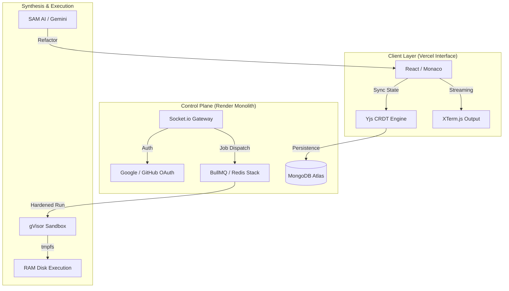

  
   
  <h1>🌑 SAM Compiler 3.0: The Obsidian Monolith</h1>
  
<b>High-Performance, Multi-Language Cloud IDE with AI Synthesis</b>

  

    
    
    
    
  

  <i>A precision-engineered development engine featuring zero-lag collaboration, hardened sandboxing, and a high-fidelity monochromatic aesthetic.</i>

---

## 🌑 The SAM Identity

**SAM Compiler** is a precision-engineered development engine. It utilizes a high-fidelity distributed architecture designed for maximal stability, low-latency synchronization, and professional-grade security.

### 🏁 **Official Production Links**
- **Official Interface (Vercel)**: [https://sam-compiler-web.vercel.app/](https://sam-compiler-web.vercel.app/)
- **Hardened API (Render)**: [https://sam-compiler.onrender.com](https://sam-compiler.onrender.com)

---

## ⚡ Key Features

### 🖋️ Professional IDE Suite
*   **Monaco Engine**: Powered by the same core as VS Code, optimized with custom Obsidian themes.
*   **Polyglot Runtime**: Native, lightning-fast execution for **C++, C, Python, JavaScript, and Java**.
*   **Real-time Multi-player**: Conflict-free collaborative editing powered by **Yjs CRDTs** and WebSockets.
*   **Integrated Terminal**: High-fidelity XTerm.js integration for real-time output streaming.

### 🛡️ Enterprise-Grade Security
*   **Hardened Sandboxing**: Every execution run is isolated using **gVisor** (Google's container sandbox) and Docker.
*   **OAuth Lifecycle**: Secure "Continue with Google/GitHub" integration with automatic string-trimming and domain auto-correction.

### 🧩 Technical Highlights & Innovative Solutions
*   **Path-Agnostic Proxy Routing**: Engineered a dual-mount routing system to resolve complex header-stripping issues common in distributed proxy environments.
*   **Dynamic Domain Guard**: Implemented backend logic to auto-correct legacy subdomains in OAuth handshakes, ensuring zero-friction login.
*   **Zero-Lag Synchronization**: Optimized binary CRDT updates over WebSockets for a sub-50ms latency editing experience.

---

## 🏛️ System Architecture

SAM utilizes a distributed control plane to manage isolation and high-frequency synchronization.

---

## 🛠️ Performance Tech Stack

| Domain | Technology | Implementation |
| :--- | :--- | :--- |
| **Frontend** | React 18 / Vite | High-frequency UI updates & Framer Motion |
| **Editor** | Monaco / Yjs | Professional editing with binary CRDT sync |
| **Backend** | Node.js / Express | Distributed task orchestration & JWT security |
| **Queue** | BullMQ / Redis | High-throughput background code execution |
| **Security** | gVisor / Docker | Multi-layer kernel isolation for user code |
| **AI** | Google Gemini | Large Language Model synthesis & explanation |

---

## 🚀 "Zero-Error" Sync Checklist

To ensure your deployment is perfectly stabilized, follow this domain synchronization checklist:

### 1. GitHub Dashboard Settings
*   **Homepage URL**: `https://sam-compiler-web.vercel.app`
*   **Authorization callback URL**: `https://sam-compiler.onrender.com/api/auth/github/callback`

### 2. Google OAuth Credentials
*   **Authorized JavaScript origins**: `https://sam-compiler-web.vercel.app`
*   **Authorized redirect URIs**: `https://sam-compiler.onrender.com/api/auth/google/callback`

### 3. Production Environment Variables
*   **WEB_ORIGIN**: `https://sam-compiler-web.vercel.app`
*   **CALLBACK_URL_BASE**: `https://sam-compiler.onrender.com/api/auth`

---

## ⚕️ Troubleshooting: Frequent Issues

- **404: NOT_FOUND on login**: Ensure your backend `auth.routes.js` redirects to the frontend root (`/`) and not a legacy `/login` path.
- **redirect_uri_mismatch**: Verify that the URL in your GitHub/Google dashboard exactly matches the Render monolithic domain (`https://sam-compiler.onrender.com`).
- **Invalid Client Secret**: Our `env.js` automatically trims secrets, but ensure you haven't copy-pasted partial keys.

---

## 💼 Engineer & Designer
**[Syed Mukheeth](https://linkedin.com/in/syedmukheeth)**
*Specializing in High-Scale Distributed Infrastructure and Modern UX Engineering.*

   
  
   
  v3.0.0-OBSIDIAN | Handcrafted with Precision

