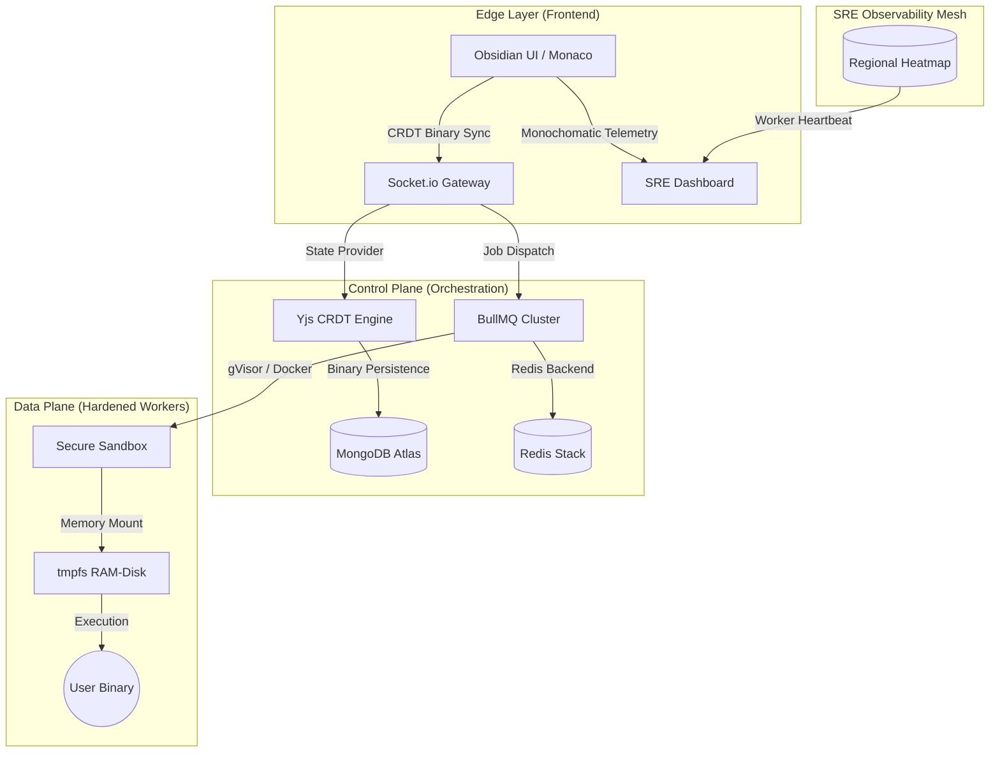

<div align="center">
  
  <br>
  <h1>SAM Compiler — Obsidian Monolith</h1>
  <p><b>The High-Scale, Distributed Syntax Analysis Machine</b></p>
  
  <p>
    
    
    
    
  </p>

  <i>A precision engineering masterpiece featuring pure monochromatic aesthetics, real-time binary state synchronization, and hardened cloud execution.</i>
</div>

---

## 🌑 The Obsidian Identity

**SAM Compiler** is an enterprise-grade cloud IDE redefined through the **Obsidian Monolith** design system. By stripping away visual clutter and adopting a strict, high-contrast black-and-white aesthetic, we prioritize code clarity and developer focus above all else.

Built for **high-scale reliability** and **sub-millisecond latency**, SAM provides an elite development environment where engineering meets art.

---

## ⚡ Core Capabilities

### 🖋️ Monolith IDE
*   **Monaco Engine**: Industrial-strength editor powering VS Code, optimized for pure B&W high-contrast rendering.
*   **Polyglot Logic**: Native support for **50+ languages**, including C++, Rust, Go, Python, and Java.
*   **AI Synthesis**: Deep integration with Gemini Pro for automated refactoring, bug detection, and architectural explanations.

### 🌓 Absolute Monochrome UI
*   **Obsidian Design System**: A unified Black, White, and Slate color palette. No distracting glows, just pure focus.
*   **Dynamic Theme-Sensing**: Intelligent switching between **Deep Obsidian Dark** and **Paper White Light** modes, including automatic favicon synchronization.
*   **B&W SRE Dashboard**: High-fidelity observability charts and metrics designed for maximum information density without the noise.

### ⛓️ Distributed Execution Plane
*   **Hardened Sandboxing**: Multi-layer isolation using gVisor and Docker, ensuring absolute security for every code run.
*   **Zero-Disk I/O**: Workspaces utilize `tmpfs` RAM-disks to eliminate host leakage and maximize throughput.
*   **BullMQ Clustering**: A robust Redis-backed queue intelligently handles hundreds of concurrent compilation requests.

### 🤝 Mathematical Collaboration
*   **Yjs CRDT Engine**: Mathematically guaranteed state merging for real-time multiplayer editing without conflicts.
*   **Binary Snapshotting**: Instant session persistence allows resuming complex development environments in milliseconds.

---

## 🏛️ System Architecture

SAM is architected as a decoupled, horizontally scalable ecosystem:



---

## 🛠️ Performance Stack

| Layer | Technology | Philosophy |
| :--- | :--- | :--- |
| **Interface** | React 18, Framer Motion | Fluid, high-contrast, zero-lag |
| **Synchronization** | Yjs, Socket.io | Mathematical eventual consistency |
| **Logic** | Node.js (V20), Express, Zod | Safe, typed orchestration |
| **Data Plane** | BullMQ, Redis, gVisor | Hardened, distributed execution |
| **Observability** | SAM SRE Mesh | High-density information display |

---

## 🏃 Deployment Guide

### 1. Monorepo Initialization
```bash
# Clone the repository
git clone https://github.com/syedmukheeth/SAM-Compiler.git
cd SAM-Compiler

# Install unified dependencies
npm install

# Build & Run Development Environment
npm run dev
```

### 2. Environment Configuration
Ensure `.env` files are correctly configured in `apps/api`, `apps/web`, and `apps/worker` based on the provided templates.

---

## 💼 Engineer: [Syed Mukheeth](https://linkedin.com/in/syedmukheeth)
*Specializing in High-Scale Distributed Systems and Hardened Cloud Infrastructure.*

<div align="center">
  <br>
  
  <br>
  <sub>v2.5.0-OBSIDIAN | Powered by the MONOLITH Design System</sub>
</div>
